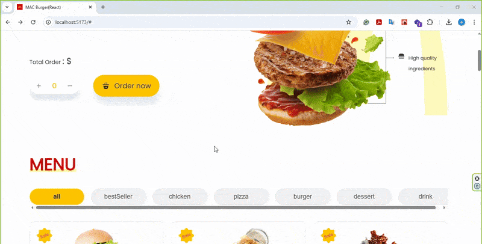

#App Demo

#Food Order App
یک اپلیکیشن سفارش غذا از رستوران که کاربران میتوانند از بین منوی هایی که با کلیک رو دسته بندی آنها، غذای هر دسته بندی را نمایش میدهد انتخاب و به سبد خرید اضافه و ثبت سفارش نمایند.
این اپ با react و به صورت SPA ساخته شده است.

#ویژگی ها
-نمایش لیست غذا ها با جزییات
-افزودن غذا به سبد خرید
-نمایش مودال "محصول به سبد خرید اضافه شد " و عدم نمایش خودکار پس از 3 ثانیه
-صفحات لاگین و ساین این کاربردی
-طراحی به صورت SPA
-استفاده از "React-router-dom" برای مدیریت مسیرها
-استفاده از ""react-icons برای ایکون های کاربردی

#پیش نیازها
-node.js
-npm

#نصب(installation)

Bash:
git clone
https://
npm install
npm run dev

#ساختار پروژه

food-delivery-react
|-components #reusable components
|-pages #main pages(home,login,sigin,etc.)
|-assests #include fonts
|-public
|- images #all images used in app
|-app.js #نقطه ورود اپ و تنظیم مسیرها
|- README.md
